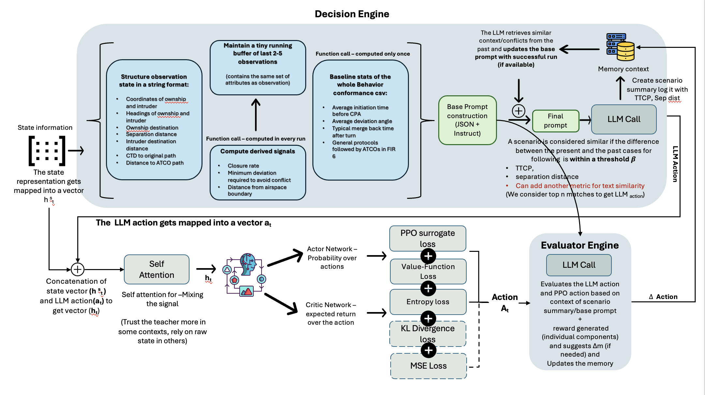

# LLM-Enhanced DRL Project Guide

At a glance, this repository teaches a reinforcement-learning policy to resolve aircraft conflict scenarios with guidance from a large language model (LLM). The LLM observes the same air-traffic state as the policy, proposes high-level maneuvers (“turn left by 10° for 3 steps”, etc.), and the PPO agent learns to blend that advice with its own understanding of the environment. The diagram below summarises the data flow between the environment, LLM, and PPO components that live in this code base.



This repository contains a reorganised version of the original notebook pipeline. The goal is to train and evaluate a PPO policy that can accept guidance from a Large Language Model (LLM) while resolving aircraft conflict scenarios.

All runnable code lives inside the `LLM-DRL restructured code/` folder. The rest of the repository still provides the scenario data, trained weights, memory logs, and other assets referenced by the scripts.

---

## 1. Folder Layout (simplified)

| Path | Purpose |
|------|---------|
| `LLM-DRL restructured code/` | New directory which contains all driver scripts. |
| `LLM-DRL restructured code/configs.py` | Central place for all configuration values. |
| `LLM-DRL restructured code/train.py` | Launches PPO + LLM training. |
| `LLM-DRL restructured code/evaluate.py` | Loads a trained policy and saves GIFs. |
| `LLM-DRL restructured code/rl_llm/` | Environment, PPO implementation, LLM helpers, utilities. |
| `featurefile_transformed_2.csv` | Scenario index used by the environment. |
| `log/`, `memory/`, `json_answers/` | Output folders created during training/evaluation. |

---

## 2. Getting Ready

1. Create and activate a Python environment.
2. Install dependencies listed in `requirements.txt`.  
   Example: `pip install -r requirements.txt`
3. Make sure the feature file and all path references in `configs.py` match your local directory structure (they do by default if you keep the repo layout untouched).
4. Install Ollama without sudo on the HPC server so LLM prompts can run locally:
   - Go to your home directory (or any writable location):  
     `cd ~`
   - Create a folder for the Ollama binaries and move into it:  
     `mkdir -p ~/.local/ollama`  
     `cd ~/.local/ollama`
   - Download and extract the Linux archive:  
     `curl -L https://ollama.com/download/ollama-linux-amd64.tgz -o ollama-linux-amd64.tgz`  
     `tar -xzf ollama-linux-amd64.tgz`
   - Add the Ollama binary to your PATH and reload your shell:  
     `echo 'export PATH="$HOME/.local/ollama/bin:$PATH"' >> ~/.bashrc`  
     `source ~/.bashrc`
   - Pull the required model (example shown for Gemma 3 12B):  
     `ollama pull gemma3:12b`
   - Start the Ollama server whenever you need it:  
     `ollama serve &` (run this in a dedicated terminal or tmux pane)
   - In another terminal or pane, create/activate your Python environment and install requirements:  
     `conda create --name llm_drl python=3.11`  
     `conda activate llm_drl`  
     `pip install -r requirements.txt`
5. Create two different tmux sessions (or separate terminals) — one to keep `ollama serve` running and another for training/evaluation.  
   - Create: `tmux new -s <session_name>`  
   - Attach: `tmux attach -t <session_name>`

---

## 3. Understanding `configs.py`

Below is a friendly description of every field. Only change what you need.

| Setting | Meaning and typical usage |
|---------|---------------------------|
| `RUN_NAME` | Folder name for the next training run, saved under `log/PPO/`. Pick a new name to start a clean run. |
| `LOG_DIR` | Full path to the folder where checkpoints and TensorBoard logs are stored. Normally no need to edit, it is derived from `RUN_NAME`. |
| `BEST_MODEL_PATH` | Path to `best_model.pth` inside `LOG_DIR`. |
| `LAST_CKPT_PATH` | Path to the resumable checkpoint (`last.ckpt`). |
| `REWARD_PARAMS` | Weights used by the environment reward function. This is a list of six numbers. |
| `START_LLM_AT_STEP` | Step number inside an episode before the LLM controller is allowed to act. |
| `MAX_TIMESTEPS` | Total PPO interaction steps before training stops. |
| `UPDATE_TIMESTEP` | Number of environment steps per PPO update cycle. |
| `EVAL_FREQ` | How often (in steps) to evaluate the policy during training. |
| `N_EVAL_EPISODES` | Number of evaluation episodes per evaluation cycle. |
| `SAVE_MODEL_FREQ` | How often (in steps) a weight-only `checkpoint_<step>.pth` is saved. |
| `LLM_EVERY_K` | Controller schedule: use the LLM every K episodes. |
| `LLM_FIRST_N` | Controller schedule: stop using the LLM after N episodes (set large if you want it almost always). |
| `EVAL_RUN_NAME` | Folder name (under `log/PPO`) that `evaluate.py` should use when loading `best_model.pth`. |
| `EVAL_LOG_DIR` | Full path to that evaluation folder. Usually leave it derived from `EVAL_RUN_NAME`. |
| `EVAL_BEST_MODEL_PATH` | Path to the weights file used for evaluation. |
| `EVAL_OUTPUT_DIR` | Directory where GIFs are saved. You can change this if you prefer a different output location. |
| `FEATUREFILE_PATH` | Location of the scenario CSV file. Adjust only if you move the data file. |
| `MEMORY_DIR` | Root folder for episode-level LLM memory logs. |
| `JSON_ANSWERS_DIR` | Folder where prompt/response JSON files are stored. |
| `EVAL_MEMORY_PATH` | Optional shared memory notes file used by the evaluator. |

### Example configuration for a fresh PPO run
```python
RUN_NAME = "PPO_v8_clean_start"
LOG_DIR = str(PROJECT_ROOT / "log" / "PPO" / RUN_NAME)
# other fields left as defaults...
```

If you only want to run evaluation on a previously trained model, make sure `EVAL_RUN_NAME` matches the exact run folder (for example `"PPO_v7_LLM_RL"`) that contains `best_model.pth`.

---

## 4. Training a Model (`train.py`)

1. Edit `RUN_NAME` in `configs.py` to something unique (e.g. `PPO_v9_experiment`).  
   - Optional: change PPO/LLM schedule values if you want to experiment.
   - Optional: remove `last.ckpt`, `best_model.pth`, or `checkpoint_*.pth` from the `log/PPO/<RUN_NAME>/` folder if you want a clean start while reusing the same name.
2. From the repository root:
   ```bash
   cd "LLM-DRL restructured code"
   python train.py
   ```
3. During training the script:
   - Loads (or starts) the environment and PPO policy.
   - Tries to resume from `last.ckpt`, then from `best_model.pth`, and if none exists prints “No checkpoints found; starting from scratch.”
   - Records TensorBoard logs in `log/PPO/<RUN_NAME>/`.
   - Saves best weights as `best_model.pth`.
   - Periodically writes weight-only `checkpoint_<step>.pth`.
   - Creates LLM memory folders (inside `memory/`) when LLM episodes occur.
4. Stop training at any time with `Ctrl + C`. The script writes `interrupted.ckpt` so you can resume later.
5. Visualise metrics with TensorBoard:
   ```bash
   tensorboard --logdir ../log/PPO
   ```

---

## 5. Evaluation (`evaluate.py`)

1. Set `EVAL_RUN_NAME` in `configs.py` to point to the training folder whose `best_model.pth` you want to replay (for example `"PPO_v9_experiment"`).
2. From the repository root:
   ```bash
   cd "LLM-DRL restructured code"
   python evaluate.py
   ```
3. The script:
   - Loads `best_model.pth` from `log/PPO/<EVAL_RUN_NAME>/`.
   - Runs the environment without the LLM (deterministic policy).
   - Saves PNG frames for each step of every episode and converts them into GIFs stored under `Evaluation GiFs/`.
   - Prints the GIF path and return for each episode.
4. To evaluate more than one episode, change the loop near the end of `evaluate.py`:
   ```python
   for ep in range(1, 6):  # runs 5 GIFs
       ...
   ```
5. To change the frame rate of the GIF, adjust the `fps` parameter in `_save_gif`.

---

## 6. Typical Workflows

### Train a New Policy From Scratch
1. Update `RUN_NAME` in `configs.py`.
2. Optionally tweak hyper-parameters.
3. Run `train.py`. Because the log directory is new (or empty), the script starts from random weights.

### Continue Training From an Existing Checkpoint
1. Leave `RUN_NAME` unchanged and make sure `last.ckpt` exists in `log/PPO/<RUN_NAME>/`.
2. Run `train.py`. The script resumes from that checkpoint automatically.

### Evaluate a Completed Run
1. Set `EVAL_RUN_NAME` to the run folder that has the policy you want.
2. Run `evaluate.py` to generate GIFs.

---

## 7. Helpful Tips

- Never commit `__pycache__/` folders or other generated files; add them to `.gitignore` if needed.
- Training can produce large amounts of data; archive or delete old `log/` subfolders you no longer need.
- If you move the repository, re-check `FEATUREFILE_PATH`, `MEMORY_DIR`, and other absolute paths in `configs.py`.
- Keep prompt strings out of version control if they contain API keys or sensitive instructions.

This guide should provide everything you need to configure, run, and understand the restructured code base. If you want a printable reference, see the LaTeX document at `LLM-DRL restructured code/LLM_DRL_documentation.tex`.
